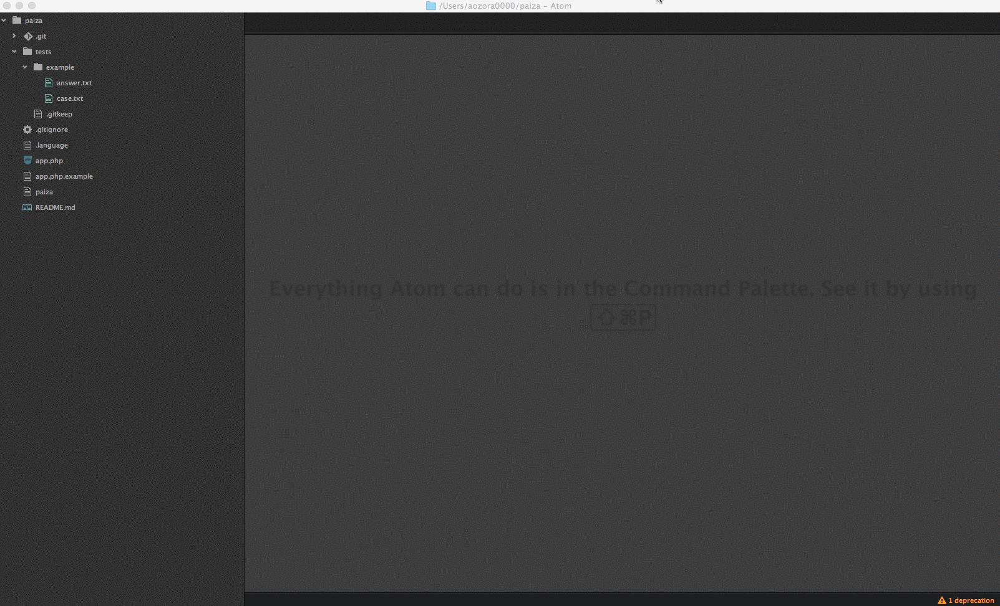

# Paiza試験用テストツール
[https://paiza.jp](https://paiza.jp)のコーディングスキルチェック用テストツール



## 動作確認環境
- Mac OSX YOSEMITE
- iTerm2
- Zsh
- PHP(スキルチェック用言語)

## 使い方

```
./paiza [command]
```

## テスト用ファイルについて
```tests/[numeric]/ ```

##### case.txt
標準からの入力をテキストで入力してください。

##### answer.txt
テスト成功時の出力結果を入力してください。

## コマンド
コマンド名 | 役割
:-:|:-:
~~new~~ | ~~テストケースを削除し、新しいテストケースを作成します。~~
add [testcase] | 新しいテストケースを作成します。
run | テストケースを全て実行・評価します。
verbose | テストケースを全て実行・評価をし、詳細な結果を出力します。
clean | テストケースを全て削除します。

## テスト環境について
```
cat .language

# スクリプト実行ファイルのパス
language=$(which php)

# テスト用スクリプトのパス
target=app.php.example
```
